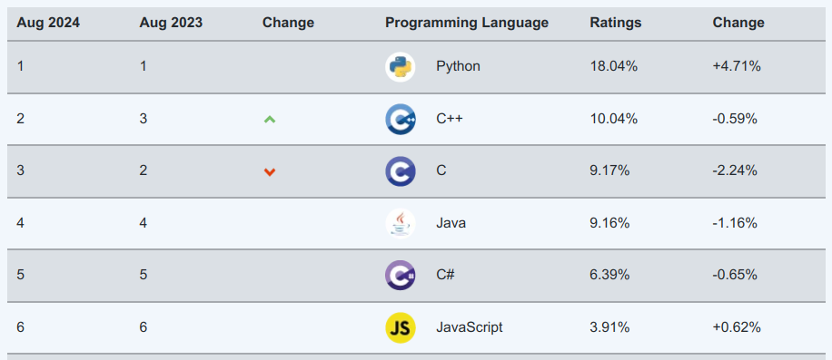
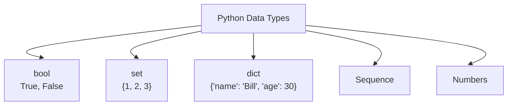
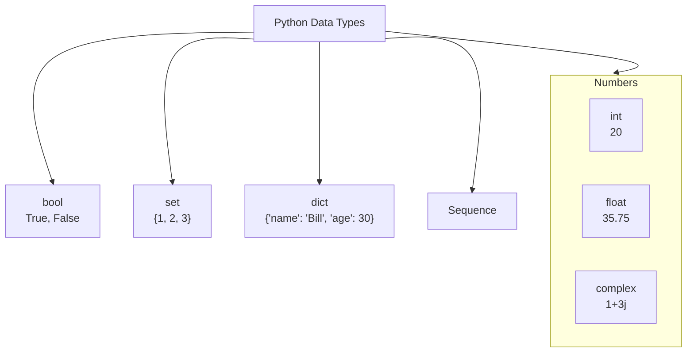
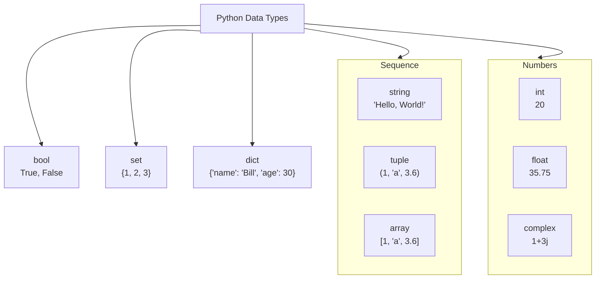
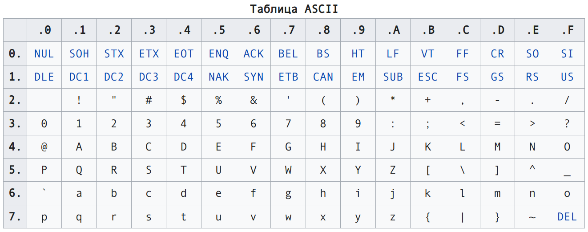

# Основы программирования. Лекция 1
Python. Переменные. Типы данных. Память. Оформление кода

---

# Что мы будем использовать в этом курсе?

- Linux
- Visual Studio Code
- git
- Python
- Для тестирования кода - pytest
- Для проверки оформления кода - линтер flake8 (возможно, ruff)

---

# Язык Python

- Создан в 1991 г.
- Создатель: Гвидо Ван Россум
- Объектно-ориентированный
- Мультипарадигменный
- Интерпретируемый (cpython)
- Использует динамическую типизацию
- Официальный репозиторий: github.com/python
- Официальная документация: docs.python.org

---

# Рейтинг TIOBE 



---
layout: fact
---

# Zen of Python

Дзен языка python всегда можно посмотреть, вызвав
интерпретатор и выполнив код `import this`

---

# Zen of Python

::div{style="column-count: 2;"}

  1. Beautiful is better than ugly.
  2. Explicit is better than implicit.
  3. Simple is better than complex.
  4. Complex is better than complicated.
  5. Flat is better than nested.
  6. Sparse is better than dense.
  7. Readability counts.
  8. Special cases aren't special enough to break the rules.
  9. Although practicality beats purity.
  10. Errors should never pass silently.
  11. Unless explicitly silenced.
  12. In the face of ambiguity, refuse the temptation to guess.
  13. There should be one-- and preferably only one --obvious way to do it.
  14. Although that way may not be obvious at first unless you're Dutch.
  15. Now is better than never.
  16. Although never is often better than *right* now.
  17. If the implementation is hard to explain, it's a bad idea.
  18. If the implementation is easy to explain, it may be a good idea.
  19. Namespaces are one honking great idea -- let's do more of those!

::

---

# Zen of Python

::div{style="column-count: 2; font-size: 0.95em;"}

1. Красивое лучше, чем уродливое.
2. Явное лучше, чем неявное.
3. Простое лучше, чем сложное.
4. Сложное лучше, чем запутанное.
5. Плоское лучше, чем вложенное.
6. Разреженное лучше, чем плотное.
7. Читаемость имеет значение.
8. Особые случаи не настолько особые, чтобы нарушать правила.
9. При этом практичность важнее безупречности.
10. Ошибки никогда не должны замалчиваться.
11. Если они не замалчиваются явно.
12. Встретив двусмысленность, отбрось искушение угадать.
13. Должен существовать один и, желательно, только один очевидный способ сделать это.
14. Хотя он поначалу может быть и не очевиден, если вы не голландец.
15. Сейчас лучше, чем никогда.
16. Хотя никогда зачастую лучше, чем прямо сейчас.
17. Если реализацию сложно объяснить — идея плоха.
18. Если реализацию легко объяснить — идея, возможно, хороша.
19. Пространства имён — отличная штука! Будем делать их больше!

::

---
layout: code
---

# Код на Python

```python {all|1|2-5|6-9|10-13|14-15|16-18|all}
# комментарии выделяются октоторпом (шарпом)
""""
    Комментарии бывают и многострочные,
    как этот.
"""
message = """
    Hо это может быть просто
    длинная строка
"""
my_number = 5 # переменные должны называться через змеиный_регистр,
# а операторы - обособлены пробелами (почти всегда)
# название переменной должно быть коротким и должно однозначно 
# передавать назначение переменной
# длина строки кода - по разным стандартам не более 79, 99 или 119
#                                                  79 символов это столько -> |
if my_number % 2 == 1:
    print('При этом блоки кода разделяются отступом, не скобками')
    print('Отступ - 4 пробела')
```
---
layout: code
---

# Переменные

```python {all|1-3|4|5|6|7|all}
first_num = 5
second_num = 5.0
third_num = 5.
print('Первое число это', type(first_num))
print('Второе число это', type(second_num))
print('Третье число это', type(third_num))
print('Равны ли числа два и три? - ', second num = third num)
```

Результат выполнения:

```console {none|none|1|2|3|4|all}{at: 1}
Первое число это ‹class 'int'>
второе число это ‹class 'float'>
Третье число это <class 'float'>
Равны ли числа два и три? - True
```

---

# Где хранятся наши данные?

Все объекты вашего программного кода хранятся в оперативной памяти, пока вы сами не решите записать их в энергонезависимую память.

Примерные скорости работы разных видов памяти:
- HDD - 200–300 МБ/с
- SSD - 600–700 МБ/с
- DRAM – 20-30 ГБ/с

---

# Типы данных в языке C

| Название типа | Байт | Диапазон значений | Название типа | Байт | Диапазон значений|
| --- | --- | --- | --- | --- | --- |
| short int | 2 | -32,768 to 32,767 | signed char | 1 | -128 to 127|
| unsigned short int | 2 | 0 to 65,535 | unsigned char | 1 | 0 to 255|
| unsigned int | 4 | 0 to 4,294,967,295 | float | 4 | 1.2e-38 to 3.4e+38|
| int | 4 | -2,147,483,648 to 2,147,483,647 | double | 8 | 1.7e-308 to 1.7e+308|
| long int | 4 | -2,147,483,648 to 2,147,483,647 | long double | 16 | 0 to 1.1E+4932|
| unsigned long int | 4 | 0 to 4,294,967,295 |

---

# Типы данных в языке Python 

::center

<v-switch>
<template #0>


</template>
<template #1>


</template>
<template #2>



</template>

</v-switch>

::

---

# Классификация типов данных в Python

- Изменяемые
- Индексируемые
- Содержащие только уникальные элементы

<br><br>

::center {style="font-size: 1.5em; width: 100%;"}
Числа и строки - неизменяемые!

При этом строки - индексируемые.
::

---

# Математические операторы

::div{style="font-size: 1em;"}

| Оператор | Действие | Пример |
| :---: | --- | :---: |
| + | Сложение двух операндов или унарный плюс | x + y + 2 |
| - | Вычитание правого оператора из левого или унарный минус | x - y- 2 |
| * | Умножение двух операндов | x * y |
| / | Деление левого операнда на правый (результат всегда типа float) | x / y |
| % | Остаток от деления левого операнда на правый | x % y (остаток от x / y) |
| // | Деление с округлением — деление, результат которого корректируется в меньшую сторону | x // y |
| ** | Показатель степени — левый операнд возводится в значение правого операнда | x**y |

::

---

# Операторы сравнения

| Оператор | Действие | Пример |
| :---: | --- | :---: |
| > | Больше чем: True, если левый операнд больше правого | x > y
| < | Меньше чем: True, если левый операнд меньше правого | x < y
| == | Равно: True, если операнды равны между собой | x == y
| != | Не равно: True, если операнды не равны между собой | x != y
| >= | Больше или равно: True, если левый операнд больше или равен правому | x >= y
| <= | Меньше или равно: True, если левый операнд меньше или равен правому | x <= y

---

# Логические операторы

| Оператор | Действие | Пример |
| :---: | :---: | :---: |
| and | И: True, если оба операнда True | x and y
| or | ИЛИ: True, если хотя бы один из операндов True | x or y
| not | НЕ: True, если операнд False | not x

---

# Побитовые операторы

$$
x = 10, y=4
$$

| Оператор | Действие | Пример |
| :---: | :---: | :---: |
| & | Побитовое И | x & y = 0 (00000000) |
| \| | Побитовое ИЛИ | x \| y = 14 (00001110) |
| ~ | Побитовое НЕ | ~x = -11 (11110101) |
| ^ | Побитовое исключающее ИЛИ (XOR) | x ^ y = 14 (00001110) |
| << | Побитовый сдвиг влево | x << 2 = 40 (00101000) |
| >> | Побитовый сдвиг вправо | x >> 2 = 2 (00000010) |

---

# Операторы вхождения и тождественности

| Оператор | Действие | Пример |
| :---: | :---: | :---: |
| `in` | True, если значение или переменная есть в последовательности | `5 in x` |
| `not in` | True, если значения или переменной нет в последовательности | `5 not in x` |
| `is` | True, если операнды идентичны (указывают на один объект) | `x is true` |
| `is not` | True, если операнды не идентичны (не указывают на один объект) | `x is not true` |

---

# Строки

- Неизменяемый итерируемый тип данных
- Могут быть объявлены разными способами
- Поддерживают синтаксис срезов (так же, как и списки)
- Поддерживают специальные символы
- Поддерживают интерполяцию
- Поддерживают форматирование
- Отдельные символы имеют кодировку по таблице ASCII

---

::center

::

---
layout: code
---

# Строки. Способы объявления

```py {all|1-3|4-13|15-17|all}
# Строки могут быть заключены как в одинарные, так и в двойные кавычки
message = 'hello'
recepient = "world"

# Длинные строки можно заключить в любые кавычки, повторенные трижды
greeting = """
    - Hello
      there!
"""
answer = '''
    - General
      Kenobi!
'''

# Строки могут быть перенесены в коде с помощью символа переноса
same_dialogue = ' hello \
  again'
```

---

# Индексы и срезы (slices)

- Получение символа из строки имеет следующий синтаксис: `имя_переменной[индекс]`
- Срез имеет синтаксис: `имя_переменной[начало:конец:шаг]`

<br><br><br>

::center
  :::span{style="font-size: 1.5em; width: 100%;"}
    При этом начало включено, конец - нет!
  :::
::

---

# Индексы и срезы (slices). Примеры

::div{style="font-size: 0.9em;"}

| Последовательность | a | b | c | d | e | f | g | Результат |
| --- | :---: | :---: | :---: | :---: | :---: | :---: | :---: | --- |
| Индексы | 0(-7) | 1(-6) | 2(-5) | 3(-4) | 4(-3) | 5(-2) | 6(-1) |  |
| `[:]` | + | + | + | + | + | + | + | abcdefg |
| `[::-1]` | + | + | + | + | + | + | + | gfedcba |
| `[::2]` | + |  | + |  | + |  | + | aceg |
| `[1::2]` | | + |  | + |  | + |  |  bdf |
| `[:1]` | + |  |  |  |  |  |  | a |
| `[-1:]` |  |  |  |  |  |  | + | g |
| `[3:4]` |  |  |  | + |  |  |  | d |
| `[-3:]` |  |  |  |   | + | + | + | efg |
| `[-3:1:-1]` |  |  | + | + | + |  |  | edc |
| `[2:5]` |  |  | + | + | + |  |  | cde |

::

---

# Специальные экранируемые символы в строках


| Символ | Описание |
| :---: | --- |
| `\` в самом конце строки | Игнорируется, строка продолжается на новой строке |
| `\\` | Сам символ обратного слеша (остается один символ \) |
| `\'` | Апостроф (остается один ‘) |
| `\"` | Кавычка (остается один символ ") |
| `\n` | Новая строка (перевод строки) |
| `\r` | Возврат каретки |
| `\t` | Горизонтальная табуляция |

Если вы хотите, чтобы обратный слеш игнорировался, можете использовать **raw string** ("сырую" строку). Пример:

::center
  ```py
  path = r'\path\to\folder\'
  ```
::

---

# Интерполяция в строках (f-строки)

```py {all|1-5|7-9|11-12|all}
# интерполяция строк
message = 'hello there'
name = 'Obi-Wan Kenobi'
greeting = f'{name} said: {message}'
print (greeting)

# форматирование
greeting = '{0} said: {1}'. format (name, message)
print (greeting)

# более сложное форматирование
print (' {0:*^30.1f}'. format (1.18))
```
Результат:
```console {none|1|2|3|all}{at: 1}
Obi-Wan Kenobi said: hello there
Obi-Wan Kenobi said: hello there
*************1.2**************
```